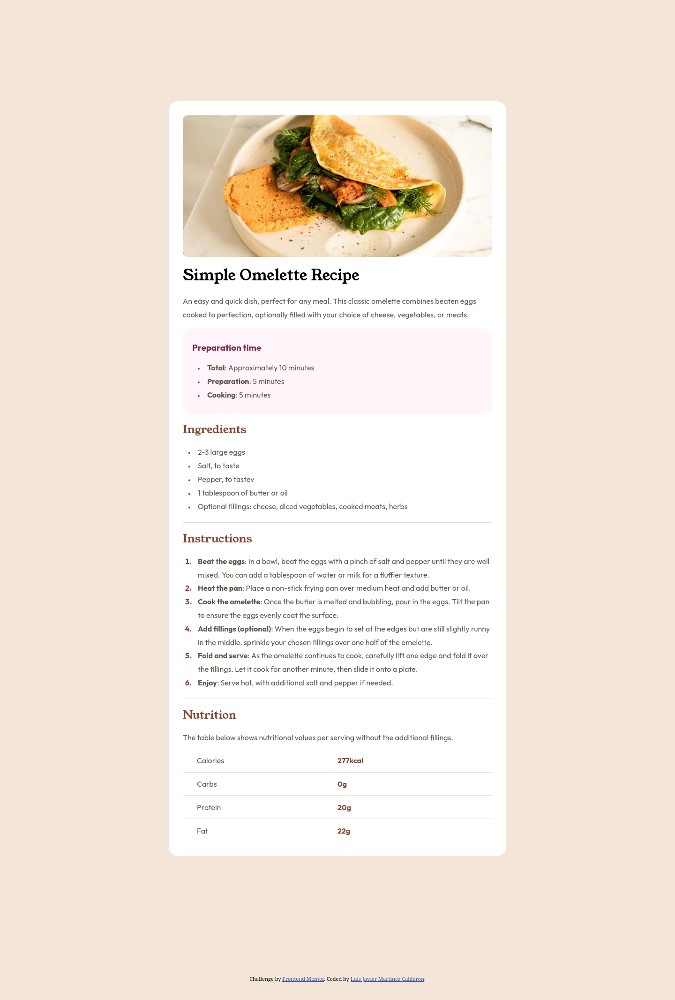
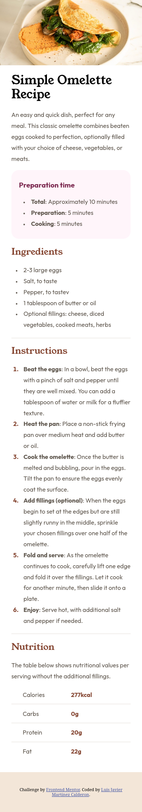

# Frontend Mentor - Recipe page solution

This is a solution to the [Recipe page challenge on Frontend Mentor](https://www.frontendmentor.io/challenges/recipe-page-KiTsR8QQKm). Frontend Mentor challenges help you improve your coding skills by building realistic projects. 

## Table of contents

- [Overview](#overview)
  - [The challenge](#the-challenge)
  - [Screenshot](#screenshot)
  - [Links](#links)
- [My process](#my-process)
  - [Built with](#built-with)
  - [What I learned](#what-i-learned)
  - [Continued development](#continued-development)
  - [Useful resources](#useful-resources)
  - [AI Collaboration](#ai-collaboration)
- [Author](#author)
- [Acknowledgments](#acknowledgments)

## Overview

### Screenshot

### Links

- Solution URL: [GitHub](https://github.com/LuisMtz11/Recipe-Page.git)
- Live Site URL: [RecipeNetlify](https://recipepageluis.netlify.app)

## My process

### Built with

- Semantic HTML5 markup
- CSS custom properties
- Flexbox
- CSS Grid

### What I learned

In this project, I learned how to properly structure an HTML page using semantic elements. I now understand the differences between elements like <section> and 
, and when it is appropriate to use each one.

I also improved my understanding of layout techniques, especially when to use Flexbox, Grid and media queries, and the advantages of each approach.

Additionally, I practiced using CSS custom properties (variables) to manage colors in a more organized and reusable way. For example:

:root {
  --White: hsl(0, 0%, 100%);
  --Stone100: hsl(30, 54%, 90%);
  --Stone150: hsl(30, 18%, 87%);
  --Stone600: hsl(30, 10%, 34%);
  --Stone900: hsl(24, 5%, 18%);
  --Brown800: hsl(14, 45%, 36%);
  --Rose800: hsl(332, 51%, 32%);
  --Rose50: hsl(330, 100%, 98%);
}

Finally, I learned the importance of writing consistent CSS to ensure better cross-browser compatibility, as well as using relative units like rem for more scalable and accessible designs.

### Continued development

### Continued development

I want to continue improving my CSS skills, especially layout techniques like Flexbox and Grid.

### Useful resources

- [Normalize.css](https://necolas.github.io/normalize.css) - Helped me ensure consistent styling across different browsers by resetting default styles.
- [ChatGPT](https://chatgpt.com) - ChatGPT helped me understand layout techniques and solve some styling issues.

### AI Collaboration

### AI Collaboration

I used ChatGPT to help me understand some CSS concepts and fix small layout issues. It was especially useful for explaining how Flexbox works.

## Author

- GitHub - [LuisMtz11](https://github.com/LuisMtz11)
- Frontend Mentor - [@LuisMTz11](https://www.frontendmentor.io/profile/LuisMtz11)

## Acknowledgments

I would like to thank Juan Pablo De la Torre Valdez for his Udemy course. Although we have never met, his teaching helped me discover Frontend Mentor and gave me the knowledge to successfully complete this challenge.
